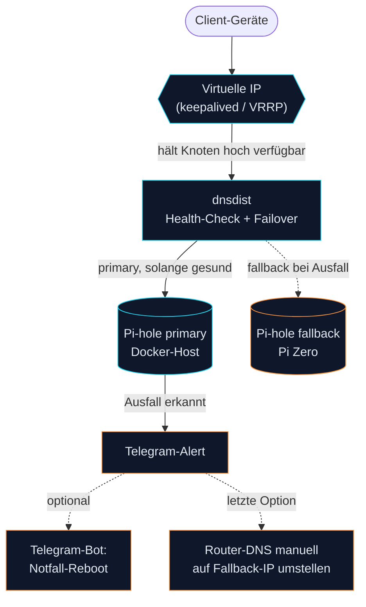

# pihole-ha

Ein einzelner Pi-hole ist im Heimnetz ein klassischer Single Point of Failure für DNS: fällt er aus, geht bei vielen Clients gar nichts mehr, weil DNS-Auflösung meist am Anfang jeder Verbindung steht. Dieses Repo dokumentiert ein Setup mit **zwei Pi-hole-Instanzen und automatischem Failover** — kombiniert aus `dnsdist` (DNS-Lastverteilung/Health-Check zwischen den beiden Pi-hole-Backends) und `keepalived` (hält eine virtuelle IP per VRRP zwischen den beiden Hosts hoch verfügbar). Fällt eine Instanz aus, übernimmt die andere automatisch, ohne dass Clients etwas davon merken.

> **Hinweis:** Dies ist ein privates Hobby-/Heimnetzprojekt und als Machbarkeitsstudie zu verstehen, kein produktionsreifes oder offiziell gepflegtes Paket. Es wird ohne jegliche Garantie bereitgestellt — Nutzung auf eigene Gefahr. Vor dem Einsatz im eigenen Netz sollte das Setup geprüft und an die eigene Umgebung angepasst werden.

## Status

**Live seit 18.04.2026.** Autonomer Power-Cycle-Recovery getestet (Recovery-Zeit <1:15 min, DNS-Kontinuität ohne Client-Ausfall).

## Voraussetzungen

- Ein Raspberry Pi Zero 2W mit [DietPi](https://dietpi.com/)
- Ein zweiter Host mit Docker (im Original ein Mac mit [OrbStack](https://orbstack.dev/), funktioniert aber mit jedem Docker-fähigen Host)
- Dein Router (z. B. eine FritzBox/AVM-Gerät) mit konfigurierbarem DNS-Server
- Grundkenntnisse in systemd (Linux-Seite) bzw. launchd (macOS-Seite), da beide Hosts eigene Units/Agents für Monitoring und Wartung mitbringen

## Architektur

Zwei HA-Mechanismen greifen ineinander:

- **`keepalived`** hält eine virtuelle IP (`<VIP>`) per VRRP zwischen dem Pi Zero und dem Docker-Host hoch verfügbar. Fällt einer der beiden Knoten aus, übernimmt der andere automatisch die VIP — die Clients merken vom Knotenwechsel selbst nichts.
- **`dnsdist`** macht dahinter das eigentliche DNS-Failover zwischen dem primären und dem Fallback-Pi-hole: Queries gehen an das primäre Pi-hole, solange dessen Health-Check grün ist; bei Ausfall schaltet dnsdist automatisch auf das Fallback-Pi-hole um. Dieses Repo enthält die `dnsdist`-Konfiguration des Pi Zero; die des zweiten Knotens ist hier nicht enthalten.

```
Clients → Router verteilt DNS <VIP>
          │
          ▼
Pi Zero (<PIZERO_IP> + <VIP>/32 Alias)
  └─ dnsdist :53
       ├─ primary  → <SERVER_IP>:5301 (Pi-hole im Docker-Container, order 1)
       └─ fallback → 127.0.0.1:5353 (Pi-hole-FTL lokal auf Pi Zero, order 2)

Health-Check alle 5 s · Primary nach 4 Fehlversuchen in Folge down, Fallback nach 2 · Policy firstAvailable
```

Hinweis zu den Ports: `dnsdist` braucht Port 53 im selben Host-Netz für sich selbst
(als der eigentliche VIP-Endpunkt). Das Pi-hole im Docker-Container läuft deshalb dahinter
auf Port 5301, nicht auf 53 — sonst würden sich beide Dienste den Port streitig machen.



Warum der Pi Zero die VIP mit übernehmen kann und nicht dauerhaft nur der Docker-Host: bei manchen Docker-Netzwerk-Setups (hier: ein bekannter OrbStack-NAT-Bug) kommen Container-Antworten immer von der Host-Primary-IP statt vom VIP-Alias — deshalb hält der Pi Zero im Normalbetrieb die VIP, und `dnsdist` übernimmt das eigentliche Backend-Failover dahinter.

## Komponenten

- **Pi Zero** (`<PIZERO_IP>` + VIP `<VIP>`): dnsdist, Pi-hole-FTL (loopback :5353), Monitor, Health-Logger, Wartungs-Cron (`pihole -up` + Gravity), systemd-Units
- **Docker-Host** (`<SERVER_IP>`): Pi-hole-Container, DNS-Heartbeat-LaunchAgent
- **Telegram-Bot** (optionale Erweiterung, nicht Teil dieses Repos): ein externer Bot für den Notfall-Reboot des Docker-Hosts, gehärtet via Sudoers/SSH-Key. Ersetzbar durch jeden anderen Fernzugriffsweg (SSH, Steckdosen-Reboot, etc.) — siehe Sicherheitshinweis unten.

## Recovery-Kette

1. **Automatisch:** Primary fällt aus → dnsdist erkennt es in ~20 s (4 × 5 s Health-Check; ~10 s beim Fallback) → Fallback liefert weiter → Telegram-Alert
2. **Manuell (bei hängendem Docker-Host):** Reboot per Telegram-Bot oder SSH auslösen
3. **Letzte Option (bei Totalausfall des Pi Zero):** Router-DNS manuell auf `<ROUTER_IP>` umstellen (SPOF bewusst akzeptiert)

## Monitoring & Crash-Forensik

- **Health-Logger** (Pi Zero, `pi_zero/pi_health_logger.sh`): Cron `@reboot` + alle 20 min. Schreibt kompakte Health-Datensätze nach `~/data/pi_health/health.jsonl` — persistent auf der SD, überlebt den DietPi-RAMlog-Wipe (`/var/log` liegt im RAM). Erfasst Uptime, Load, freien RAM, Temperatur, Undervoltage-Meldungen und ob der vorige Boot sauber war; dmesg-Snapshots bei Auffälligkeiten. Liefert nach einem Ausfall die Spur, die der RAM-only-Logmodus sonst verschluckt.
- **DNS-Heartbeat** (Docker-Host, `server/pihole_heartbeat.sh` + LaunchAgent): prüft alle 5 min funktional per `dig` über die VIP `<VIP>`. Telegram-Alarm nur bei Ausfall (nach 15 min), Recovery-Meldung, wöchentlicher Sonntag-Heartbeat. Schließt die Lücke, dass der Monitor *auf* dem Pi sich nicht selbst totmelden kann.

## Dashboard

Ein statisches Status-Dashboard liegt unter `dashboard/` (`index.html`, `app.js`, `style.css`). Es zeigt Primary/Fallback-Status, Health-Checks, Update-Cron und den optionalen Telegram-Bot als Live-Ansicht mit DE/EN-Umschalter.

- **Datenquelle:** `dashboard/app.js` lädt `data.json` + `history.json` per Fetch; sind diese nicht erreichbar (z. B. weil kein Collector läuft), fällt es automatisch auf `data.sample.json` / `history.sample.json` zurück. Damit läuft das Dashboard auch **ohne Backend** — z. B. als reine Demo per GitHub Pages, direkt aus diesem Repo.
- **Live-Betrieb:** `server/dashboard_collector.py` sammelt Status per SSH vom Pi Zero (dnsdist-API, Monitor-State, Telegram-Bot-State) und schreibt `data.json` + `history.json` nach `~/www/dash_pihole/`. Als Cron/LaunchAgent auf dem Docker-Host laufen lassen und dieses Verzeichnis bereitstellen (dort auch `index.html` und die übrigen statischen Dateien ablegen).
- **Update-Karte:** sie braucht ein serverseitiges Update-Log, das dieses Repo derzeit nicht erzeugt (die wöchentliche Wartung läuft auf dem Pi Zero und schreibt `/var/log/pihole-ha/pihole-maintenance.log` in einem anderen Format), daher bleibt diese Karte in einem Standard-Deploy leer.

## Konfiguration

Eine einzige Datei `config.env` ist die Quelle aller Deploy-Werte. Ablauf:

```bash
cp config.env.example config.env
$EDITOR config.env
./render.sh
```

`render.sh` schreibt die deploy-fertigen Dateien neben jede `*.tmpl` und bricht ab, sobald ein Wert fehlt. `config.env` und die gerenderten Dateien sind gitignored — im Repo liegen nur die `*.tmpl`.

Das Modell ist zweistufig: Die Config-/Template-Dateien werden über `render.sh` gerendert; `deploy_monitoring.sh` und `pi_zero/deploy.sh` sind Orchestrator-Skripte, die `config.env` direkt einlesen und `render.sh` selbst aufrufen — deshalb sind diese beiden **keine** `*.tmpl`.

| Variable | Bedeutung |
|---|---|
| `VIP` | Virtuelle IP, die per VRRP zwischen den beiden Hosts floatet |
| `SERVER_IP` | IP des Docker-Hosts |
| `PIZERO_IP` | IP des Raspberry Pi Zero 2W |
| `PIZERO_TAILSCALE_IP` | Tailscale-IP des Pi Zero (für SSH-Zugriff vom Docker-Host aus) |
| `PI_USER` | SSH-Login-User auf dem Pi Zero (DietPi-Standard: `dietpi`) |
| `DNS_HA_VM_IP` | IP des keepalived-MASTER-Knotens auf dem Docker-Host (bare metal oder VM) |
| `ROUTER_IP` | IP des Routers als DNS-Fallback der letzten Option |
| `LAN_SUBNET` | Heimnetz-Subnetz in CIDR-Form für die dnsdist-ACL / Firewall-Notizen |
| `VRRP_AUTH_PASS` | VRRP-Shared-Secret (keepalived kürzt auf 8 Zeichen, Klartext auf dem Draht) |
| `IFACE_PI` | Interface, an das die VIP bindet — Pi-Zero-Seite (meist `wlan0`) |
| `IFACE_VM` | Interface, an das die VIP bindet — MASTER-Knoten-Seite |

Jeder Schlüssel trägt in `config.env.example` einen einzeiligen Kommentar.

Code und Config des Failover-Monitors werden nach `/usr/local/lib/pihole-ha/` (root-owned) installiert — Poll-Intervall, VIP oder Test-Domain dort zu ändern erfordert sudo.

### Telegram-Alarme

Alle Komponenten verschicken Alarme über ein einziges Skript, `bin/telegram-send.sh`.
Es liest die Bot-Zugangsdaten aus einer Conf-Datei, die **nicht** in diesem Repo
liegt — eine Shell-Datei mit zwei Zeilen:

```
TELEGRAM_TOKEN=<bot token>
TELEGRAM_CHAT_ID=<chat id>
```

- **Pi Zero:** `/etc/telegram-notify.conf` (Modus 600, root — gemeinsam mit dem
  keepalived-VRRP-Notifier). `pihole_monitor.py` läuft als unprivilegierter
  `dietpi`-User, die Datei muss also für diesen User lesbar sein: entweder
  `chmod 644` oder `chown root:dietpi && chmod 640`. `pihole_maintenance.sh`
  läuft als root und liest dieselbe Datei direkt. `pi_zero/deploy.sh`
  installiert den Sender nach `/usr/local/lib/pihole-ha/telegram-send.sh`.
- **Docker-Host:** `~/.config/pihole-ha/telegram.conf` für den User, der die
  Heartbeat-/Collector-LaunchAgents ausführt. `deploy_monitoring.sh` legt das
  Verzeichnis an und liefert den Sender neben `pihole_heartbeat.sh` mit; die
  Conf legst du selbst dort ab.
- Den Conf-Pfad überall per Umgebungsvariable `PIHOLE_HA_TG_CONF` überschreiben.

Eine fehlende oder leere Conf ist unkritisch: der Sender loggt nach stderr und
beendet sich mit Exit 0 — Alarmierung bleibt einfach aus, bis Zugangsdaten
hinterlegt sind.

## Deploy

```bash
# im Repo-Wurzelverzeichnis, auf dem Docker-Host
docker compose up -d

# Pi Zero
cd pi_zero && ./deploy.sh

# Monitoring (Health-Logger + DNS-Heartbeat) auf beide Hosts
./deploy_monitoring.sh

# Dashboard (statische Dateien + optionaler Collector) auf dem Docker-Host
# dashboard/*.html, *.js, *.css, *.sample.json auf einen Webserver legen;
# für Live-Daten zusätzlich server/dashboard_collector.py per Cron/LaunchAgent
# alle 60 s laufen lassen (schreibt data.json + history.json nach ~/www/dash_pihole/)
```

`pi_zero/deploy.sh` und `deploy_monitoring.sh` rufen `render.sh` inzwischen selbst auf — `config.env` muss also vorher ausgefüllt sein.

## Runbooks

Setup: `pi_zero/deploy.sh`. Status-/Health-Checks der dnsdist-Backends: `pi_zero/pihole_monitor.py`. DNS-Heartbeat auf dem Docker-Host: `server/pihole_heartbeat.sh`. Dashboard-Datensammlung: `server/dashboard_collector.py`.

## Sicherheitshinweis

Der optionale Telegram-Bot für den Notfall-Reboot hat bewusst eingeschränkte Rechte: Zugriff nur über einen dedizierten SSH-Key und eine eng gefasste Sudoers-Regel (nur der Reboot-Befehl, keine Shell). Wer diesen Weg nicht nutzen möchte, kann Schritt 2 der Recovery-Kette genauso gut per manuellem SSH-Zugriff abbilden.

## Demo

Statische Demo des Dashboards mit den mitgelieferten Sample-Daten (ohne Backend): **[zorroficator.github.io/pihole-ha](https://zorroficator.github.io/pihole-ha/)**

## Offene Arbeiten

- Integration als eigenes Panel in einem übergeordneten Heimnetz-Dashboard

## License

[MIT](LICENSE)
