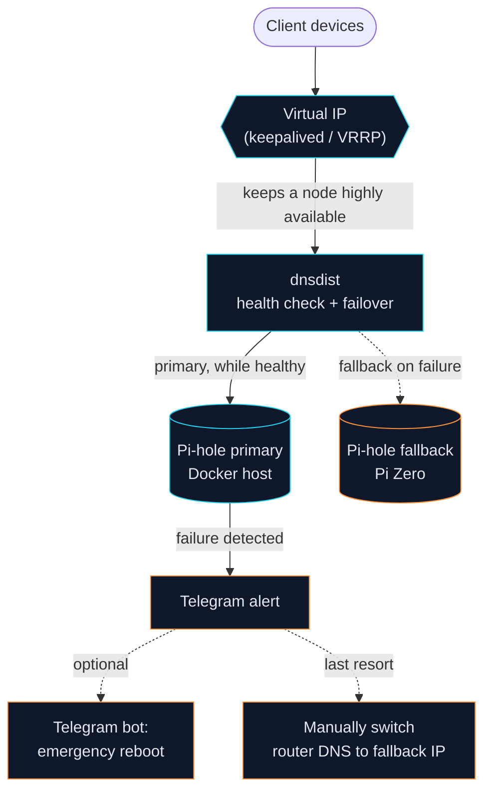

# pihole-ha

A single Pi-hole is a classic single point of failure for DNS on a home network: if it goes down, most clients lose connectivity outright, since DNS resolution sits at the start of almost every connection. This repo documents a setup with **two Pi-hole instances and automatic failover**, combining `dnsdist` (DNS load balancing / health checking between the two Pi-hole backends) with `keepalived` (keeps a virtual IP highly available between the two hosts via VRRP). If one instance fails, the other takes over automatically, transparently to clients.

> **Note:** This is a private hobby/home-network project and should be read as a feasibility study, not a production-ready or officially maintained package. It is provided without any warranty — use it at your own risk. Review and adapt the setup to your own environment before deploying it on your network.

## Status

**Live since 2026-04-18.** Autonomous power-cycle recovery tested (recovery time <1:15 min, DNS continuity without client outage).

## Prerequisites

- A Raspberry Pi Zero 2W running [DietPi](https://dietpi.com/)
- A second host running Docker (the original setup uses a Mac with [OrbStack](https://orbstack.dev/), but any Docker-capable host works)
- Your router (e.g. an AVM FritzBox) with a configurable DNS server
- Basic familiarity with systemd (Linux side) and launchd (macOS side), since both hosts run their own units/agents for monitoring and maintenance

## Architecture

Two HA mechanisms work together:

- **`keepalived`** keeps a virtual IP (`<VIP>`) highly available between the Pi Zero and the Docker host via VRRP. If either node goes down, the other automatically takes over the VIP — clients never notice the node switch itself.
- **`dnsdist`** runs on both nodes and handles the actual DNS failover behind that VIP, between the primary and fallback Pi-hole: queries go to the primary Pi-hole as long as its health check is green; on failure, dnsdist automatically switches to the fallback Pi-hole.

```
Clients → Router hands out DNS <VIP>
          │
          ▼
Pi Zero (<PIZERO_IP> + <VIP>/32 alias)
  └─ dnsdist :53
       ├─ primary  → <SERVER_IP>:5301 (Pi-hole in a Docker container, weight 10)
       └─ fallback → 127.0.0.1:5353 (Pi-hole-FTL local on Pi Zero, weight 1)

Health check every 5 s · 2 fails → down · policy firstAvailable
```

Note on ports: `dnsdist` needs port 53 on the same host network for itself (it's the actual
VIP endpoint). Pi-hole in the Docker container therefore runs behind it on port 5301, not 53 —
otherwise the two services would fight over the same port.



Why the Pi Zero can hold the VIP rather than the Docker host permanently: some Docker networking setups (here: a known OrbStack NAT bug) always return container responses from the host's primary IP instead of the VIP alias — so the Pi Zero holds the VIP in normal operation, and `dnsdist` handles the actual backend failover behind it.

## Components

- **Pi Zero** (`<PIZERO_IP>` + VIP `<VIP>`): dnsdist, Pi-hole-FTL (loopback :5353), monitor, health logger, maintenance cron (`pihole -up` + gravity), systemd units
- **Docker host** (`<SERVER_IP>`): Pi-hole container, DNS-heartbeat LaunchAgent
- **Telegram bot** (optional extension, not part of this repo): an external bot for emergency reboot of the Docker host, hardened via sudoers/SSH key. Can be replaced by any other remote-access path (SSH, smart-plug reboot, etc.) — see the security note below.

## Recovery chain

1. **Automatic:** primary goes down → dnsdist detects it within <15 s → fallback keeps serving → Telegram alert
2. **Manual (when the Docker host hangs):** trigger a reboot via the Telegram bot or SSH
3. **Last resort (total Pi Zero failure):** manually switch the router's DNS to `<ROUTER_IP>` (this single point of failure is accepted deliberately)

## Monitoring & crash forensics

- **Health logger** (Pi Zero, `pi_zero/pi_health_logger.sh`): cron `@reboot` + every 20 min. Writes compact health records to `~/data/pi_health/health.jsonl` — persistent on the SD card, survives the DietPi RAMlog wipe (`/var/log` lives in RAM). Captures uptime, load, free RAM, temperature, under-voltage messages and whether the previous boot was clean; dmesg snapshots on anomalies. Provides the trail after an outage that the RAM-only log mode otherwise swallows.
- **DNS heartbeat** (Docker host, `server/pihole_heartbeat.sh` + LaunchAgent): functional `dig` check via the VIP `<VIP>` every 5 min. Telegram alert only on failure (after 15 min), recovery message, weekly Sunday heartbeat. Closes the gap that the monitor running *on* the Pi cannot report its own death.

## Dashboard

A static status dashboard lives under `dashboard/` (`index.html`, `app.js`, `style.css`). It shows primary/fallback state, health checks, the update cron and the optional Telegram bot as a live view with a DE/EN switcher.

- **Data source:** `dashboard/app.js` fetches `data.json` + `history.json`; if those aren't reachable (e.g. no collector running), it automatically falls back to `data.sample.json` / `history.sample.json`. That means the dashboard also runs **without a backend** — e.g. as a plain demo on GitHub Pages, straight out of this repo.
- **Live operation:** `server/dashboard_collector.py` gathers status over SSH from the Pi Zero (dnsdist API, monitor state, Telegram bot state) plus the local update log, and writes `data.json` + `history.json`. Run it as a cron job/LaunchAgent on the Docker host and serve the files next to `index.html` (e.g. from a web server's document root).

## Replacing placeholders

The config files in this repo use placeholders instead of real network addresses. Replace them with your own values before deploying — affected files include `keepalived/*.conf`, `pi_zero/monitor_config.toml`, `pi_zero/dnsdist.conf`, `docker-compose.yml`, `server/*.sh` and `pi_zero/*.sh`:

| Placeholder | Meaning |
|---|---|
| `<VIP>` | Virtual IP that floats between the two hosts via VRRP |
| `<SERVER_IP>` | IP of the Docker host |
| `<PIZERO_IP>` | IP of the Raspberry Pi Zero 2W |
| `<PIZERO_TAILSCALE_IP>` | Tailscale IP of the Raspberry Pi Zero 2W (for SSH access from the Docker host) |
| `<PI_USER>` | SSH login user on the Raspberry Pi Zero 2W (e.g. the DietPi default user) |
| `<DNS_HA_VM_IP>` | IP of the keepalived node on the Docker host (if it runs inside a VM) |
| `<ROUTER_IP>` | Router IP used as the last-resort DNS fallback |
| `<LAN_SUBNET>` | Home network subnet, used for ACLs/firewall rules |
| `<PIN>` | PIN for the Telegram bot's emergency reboot command (`pi_zero/pihole_monitor.py`) |
| `<STATE>` | VRRP status parameter that keepalived passes when calling `keepalived/notify_telegram.sh` (not something you replace manually) |

Easiest way to find them all: `grep -rn '<[A-Z_]*>' .`

## Deploy

```bash
# Pi-hole on the Docker host
cd pihole-ha && docker compose up -d

# Pi Zero
cd pi_zero && ./deploy.sh

# Monitoring (health logger + DNS heartbeat) onto both hosts
./deploy_monitoring.sh

# Dashboard (static files + optional collector) on the Docker host
# Serve dashboard/*.html, *.js, *.css, *.sample.json from any web server;
# for live data, also run server/dashboard_collector.py via cron/LaunchAgent
# every 60 s (writes data.json + history.json next to index.html)
```

## Runbooks

Setup: `pi_zero/deploy.sh`. Status/health checks of the dnsdist backends: `pi_zero/pihole_monitor.py`. DNS heartbeat on the Docker host: `server/pihole_heartbeat.sh`. Dashboard data collection: `server/dashboard_collector.py`.

## Security note

The optional Telegram bot used for emergency reboots is deliberately scoped down: access is limited to a dedicated SSH key plus a narrow sudoers rule (only the reboot command, no shell). If you'd rather not use it, step 2 of the recovery chain works just as well over plain manual SSH access.

## Open work

- GitHub Pages demo of the dashboard (static, using the bundled sample data, no backend)
- Integration as a dedicated panel inside a broader home-network dashboard

## License

[MIT](LICENSE)
