# pihole-ha

A single Pi-hole is a classic single point of failure for DNS on a home network: if it goes down, most clients lose connectivity outright, since DNS resolution sits at the start of almost every connection. This repo documents a setup with **two Pi-hole instances and automatic failover**, combining `dnsdist` (DNS load balancing / health checking between the two Pi-hole backends) with `keepalived` (keeps a virtual IP highly available between the two hosts via VRRP). If one instance fails, the other takes over automatically, transparently to clients.

> **Note:** This is a private hobby/home-network project and should be read as a feasibility study, not a production-ready or officially maintained package. It is provided without any warranty — use it at your own risk. Review and adapt the setup to your own environment before deploying it on your network.

## Status

**Live since 2026-04-18.** Autonomous power-cycle recovery tested (recovery time <1:15 min, DNS continuity without client outage).

## Prerequisites

- A Raspberry Pi Zero 2W running [DietPi](https://dietpi.com/)
- A second host running Docker (the original setup uses a Mac with [OrbStack](https://orbstack.dev/), but any Docker-capable host works)
- Your router (e.g. an AVM FritzBox) with a configurable DNS server
- Basic familiarity with systemd (Linux side) and launchd (macOS side), since both hosts run their own units/agents for monitoring and maintenance

## Architecture

Two HA mechanisms work together:

- **`keepalived`** keeps a virtual IP (`<VIP>`) highly available between two VRRP nodes: the **dns-ha VM** on the Docker host (MASTER, priority 150) holds the VIP in normal operation; the **Pi Zero** (BACKUP, priority 100) takes it over only if dns-ha fails. keepalived manages the VIP exclusively — there is no separate static-bind service. Clients never notice the node switch itself.
- **`dnsdist`** handles the actual DNS failover behind that VIP, between the primary and fallback Pi-hole: queries go to the primary Pi-hole as long as its health check is green; on failure, dnsdist automatically switches to the fallback Pi-hole. **Both** nodes run an identical `dnsdist` config (primary `<SERVER_IP>:5301`, fallback local `127.0.0.1:5353`); this repo ships both (`dns_ha/` and `pi_zero/`).

```
Clients → Router hands out DNS <VIP>
          │
          ▼
<VIP> (VRRP: dns-ha VM = MASTER in normal operation, Pi Zero = BACKUP)
  └─ dnsdist :53   (identical config on both nodes)
       ├─ primary  → <SERVER_IP>:5301 (Pi-hole in a Docker container, order 1)
       └─ fallback → 127.0.0.1:5353 (Pi-hole-FTL local on the active node, order 2)

Health check every 5 s · primary marked down after 4 consecutive failures, fallback after 2 · policy firstAvailable
```

Note on ports: `dnsdist` needs port 53 on the same host network for itself (it's the actual
VIP endpoint). Pi-hole in the Docker container therefore runs behind it on port 5301, not 53 —
otherwise the two services would fight over the same port.


Why the VIP lives on a dedicated `dns-ha` VM on the Docker host rather than on the host itself or inside the Pi-hole container: some Docker networking setups (here: a known OrbStack NAT bug) always return container responses from the host's primary IP instead of the VIP alias. A lightweight VM alongside the container has its own network identity and is not affected, so it runs as VRRP MASTER and holds the VIP in normal operation; the Pi Zero stands by as BACKUP, and `dnsdist` handles the actual backend failover behind the VIP on whichever node is active.

## Components

- **dns-ha VM** (on the Docker host, VRRP MASTER): keepalived + dnsdist — holds the VIP `<VIP>` in normal operation
- **Pi Zero** (`<PIZERO_IP>`, VRRP BACKUP): keepalived + dnsdist, Pi-hole-FTL (loopback :5353), monitor, health logger, maintenance cron (`pihole -up` + gravity), systemd units — takes the VIP only on dns-ha failure
- **Docker host** (`<SERVER_IP>`): Pi-hole container, DNS-heartbeat LaunchAgent, and the host running the dns-ha VM
- **Telegram bot** (optional extension, not part of this repo): an external bot for emergency reboot of the Docker host, hardened via sudoers/SSH key. Can be replaced by any other remote-access path (SSH, smart-plug reboot, etc.) — see the security note below.

## Recovery chain

1. **Automatic:** primary goes down → dnsdist detects it within ~20 s (4 × 5 s health check; ~10 s for the fallback) → fallback keeps serving → Telegram alert
2. **Manual (when the Docker host hangs):** trigger a reboot via the Telegram bot or SSH
3. **Last resort (total Pi Zero failure):** manually switch the router's DNS to `<ROUTER_IP>` (this single point of failure is accepted deliberately)

## Monitoring & crash forensics

- **Health logger** (Pi Zero, `pi_zero/pi_health_logger.sh`): cron `@reboot` + every 20 min. Writes compact health records to `~/data/pi_health/health.jsonl` — persistent on the SD card, survives the DietPi RAMlog wipe (`/var/log` lives in RAM). Captures uptime, load, free RAM, temperature, under-voltage messages and whether the previous boot was clean; dmesg snapshots on anomalies. Provides the trail after an outage that the RAM-only log mode otherwise swallows.
- **DNS heartbeat** (Docker host, `server/pihole_heartbeat.sh` + LaunchAgent): functional `dig` check via the VIP `<VIP>` every 5 min. Telegram alert only on failure (after 15 min), recovery message, weekly Sunday heartbeat. Closes the gap that the monitor running *on* the Pi cannot report its own death.

## Dashboard

A static status dashboard lives under `dashboard/` (`index.html`, `app.js`, `style.css`). It shows primary/fallback state, health checks, the update cron and the optional Telegram bot as a live view with a DE/EN switcher.

- **Data source:** `dashboard/app.js` fetches `data.json` + `history.json`; if those aren't reachable (e.g. no collector running), it automatically falls back to `data.sample.json` / `history.sample.json`. That means the dashboard also runs **without a backend** — e.g. as a plain demo on GitHub Pages, straight out of this repo.
- **Live operation:** `server/dashboard_collector.py` gathers status over SSH from the Pi Zero (dnsdist API, monitor state, Telegram bot state), and writes `data.json` + `history.json` to `~/www/dash_pihole/`. Run it as a cron job/LaunchAgent on the Docker host and serve that directory (put `index.html` and the other static files there as well).
- **Weekly-update card:** it needs a server-side update log that this repo does not currently produce (the weekly maintenance runs on the Pi Zero and writes `/var/log/pihole-ha/pihole-maintenance.log` in a different format), so that card stays empty in a stock deploy.

## Configuration

A single file `config.env` is the source for every deploy value. Workflow:

```bash
cp config.env.example config.env
$EDITOR config.env
./render.sh
```

`render.sh` writes the deploy-ready files next to each `*.tmpl` and aborts as soon as a value is missing. `config.env` and the rendered files are gitignored — only the `*.tmpl` are committed.

The model is two-tier: the config/template files are rendered via `render.sh`; `deploy_monitoring.sh` and `pi_zero/deploy.sh` are orchestrator scripts that read `config.env` directly and call `render.sh` themselves — which is why those two are not `*.tmpl`.

| Variable | Meaning |
|---|---|
| `VIP` | Virtual IP that floats between the two hosts via VRRP |
| `SERVER_IP` | IP of the Docker host |
| `PIZERO_IP` | IP of the Raspberry Pi Zero 2W |
| `PIZERO_TAILSCALE_IP` | Tailscale IP of the Pi Zero (for SSH access from the Docker host) |
| `PI_USER` | SSH login user on the Pi Zero (DietPi default: `dietpi`) |
| `DNS_HA_VM_IP` | IP of the keepalived MASTER node on the Docker host (bare metal or a VM) |
| `SERVER_SSH_TARGET` | SSH target for the Docker host that runs the Multipass VM (used by `dns_ha/deploy.sh`) |
| `DNS_HA_VM_NAME` | Multipass instance name of the dns-ha VM (`multipass exec` target) |
| `ROUTER_IP` | Router IP used as the last-resort DNS fallback |
| `LAN_SUBNET` | Home LAN subnet in CIDR form, for the dnsdist ACL / firewall notes |
| `VRRP_AUTH_PASS` | VRRP shared secret (keepalived truncates it to 8 chars, sent in cleartext) |
| `IFACE_PI` | Interface the VIP binds to — Pi Zero side (usually `wlan0`) |
| `IFACE_VM` | Interface the VIP binds to — MASTER node side |

Every key carries a one-line comment in `config.env.example`.

The failover monitor's code and config are installed to root-owned `/usr/local/lib/pihole-ha/` — changing the poll interval, VIP or test domain there needs sudo.

### Telegram alerting

Every component sends alerts through one script, `bin/telegram-send.sh`. It reads
the bot credentials from a conf file that is **not** in this repo — a shell file
with two lines:

```
TELEGRAM_TOKEN=<bot token>
TELEGRAM_CHAT_ID=<chat id>
```

- **Pi Zero:** `/etc/telegram-notify.conf` (mode 600, root — shared with the
  keepalived VRRP notifier). `pihole_monitor.py` runs as the unprivileged
  `dietpi` user, so the file must be readable by that user: either `chmod 644`,
  or `chown root:dietpi && chmod 640`. `pihole_maintenance.sh` runs as root and
  reads the same file directly. `pi_zero/deploy.sh` installs the sender to
  `/usr/local/lib/pihole-ha/telegram-send.sh`.
- **Docker host:** `~/.config/pihole-ha/telegram.conf` for the user that runs
  the heartbeat / collector LaunchAgents. `deploy_monitoring.sh` creates the
  directory and ships the sender next to `pihole_heartbeat.sh`; you drop the
  conf in.
- Override the conf path anywhere with the `PIHOLE_HA_TG_CONF` environment
  variable.

A missing or empty conf is not fatal: the sender logs to stderr and exits 0, so
alerting stays off until you provide credentials.

## Deploy

```bash
# from the repo root, on the Docker host
docker compose up -d

# dns-ha VM (VRRP MASTER): dnsdist + keepalived + nonlocal-bind sysctl, pushed
# into the Multipass VM via
#   ssh <SERVER_SSH_TARGET> "multipass exec <DNS_HA_VM_NAME> -- ..."
cd dns_ha && ./deploy.sh

# Pi Zero (VRRP BACKUP): dnsdist + keepalived + monitor
cd pi_zero && ./deploy.sh

# Monitoring (health logger + DNS heartbeat) onto both hosts
./deploy_monitoring.sh

# Dashboard (static files + optional collector) on the Docker host
# Serve dashboard/*.html, *.js, *.css, *.sample.json from any web server;
# for live data, also run server/dashboard_collector.py via cron/LaunchAgent
# every 60 s (writes data.json + history.json to ~/www/dash_pihole/)
```

`dns_ha/deploy.sh`, `pi_zero/deploy.sh` and `deploy_monitoring.sh` now run `render.sh` themselves — so `config.env` must be filled in first.

## Runbooks

Setup: `dns_ha/deploy.sh` (MASTER node) and `pi_zero/deploy.sh` (BACKUP node). Status/health checks of the dnsdist backends: `pi_zero/pihole_monitor.py`. DNS heartbeat on the Docker host: `server/pihole_heartbeat.sh`. Dashboard data collection: `server/dashboard_collector.py`.

## Security note

The optional Telegram bot used for emergency reboots is deliberately scoped down: access is limited to a dedicated SSH key plus a narrow sudoers rule (only the reboot command, no shell). If you'd rather not use it, step 2 of the recovery chain works just as well over plain manual SSH access.

## Demo

Static demo of the dashboard using the bundled sample data (no backend): **[zorroficator.github.io/pihole-ha](https://zorroficator.github.io/pihole-ha/)**

## Open work

- Integration as a dedicated panel inside a broader home-network dashboard

## License

[MIT](LICENSE)
